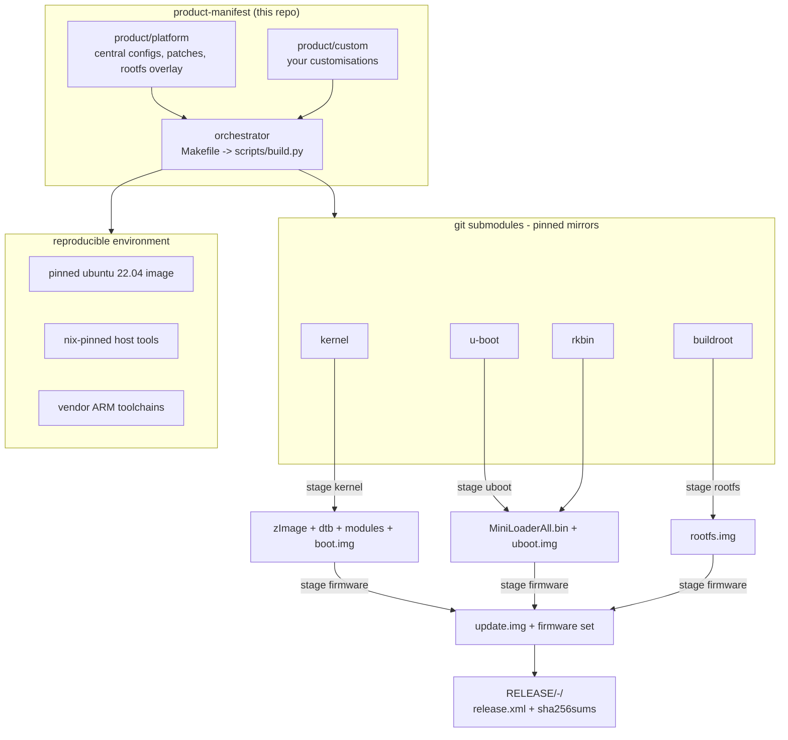

# shu-sdk — 极简 Luckfox Lyra (RK3506) 构建系统

一个为 [Luckfox Lyra](https://wiki.luckfox.com/) 系列(RK3506 / RK3506B)打造的小型、
可复现的构建系统。它把 **u-boot + kernel + buildroot** 构建成一组可烧写的产物,使用
固定的 ubuntu 22.04 docker 容器,而容器的主机工具链本身用 nix 固定。它*不是*官方 SDK
构建机制的拷贝——它保留官方源码仓库,但用一套干净的 pi-gen 风格的 stage 流水线取代
构建编排。



## 为什么是这个形态

- **仓库以 submodule 形式存在。** `vendor/rockchip/{kernel,u-boot,buildroot,rkbin,external,app}`
  是指向 Luckfox SDK 组件仓库(kernel/u-boot/buildroot/rkbin + external 组件 + buildroot
  包同步的 app 源码)固定镜像(`whatshu/lyra-*`)的 git submodule。不使用官方 `repo` 工具。
  每个 commit 都记录在 release manifest 中。
- **配置集中管理。** 板级定义(`config/boards/*.mk`)和组件配置
  (`product/platform/configs/`)放在本仓库。**完整构建**会覆盖 vendor 树,重置任何手工
  调整过的临时配置;**部分构建**保持临时配置不动,所以 `make kernel-menuconfig && make kernel`
  能保留你的修改。
- **stage 用 Python。** `scripts/build.py` 负责 stage 发现、排序、配置覆盖和环境;每个
  stage 的配方是一个小 `run.sh`。按启动顺序:`uboot → kernel → rootfs → firmware`。
- **可复现的环境。** 容器是 `ubuntu:22.04@sha256:0199853f…`(不可变摘要)。主机构建工具由
  镜像摘要加记录的 apt 包版本(在 manifest 中)固定;可选的 `Dockerfile.nix` variant 改为
  把 sha256 锁定的 nixpkgs 工具链烘焙进 `/nix/store`,适合 nix 缓存可达的网络。ARM
  交叉编译器是按 sha256 固定的官方二进制发布。
- **发布是不可变快照。** 只有 `make release` 保存产物——到 `RELEASE/<target>-<timestamp>/`,
  带 `release.xml`(所有仓库 commit、镜像哈希、工具哈希)和 `sha256sums.txt`。`make build`
  在易失的 `out/` 里产生相同输出,每次运行覆盖。
- **永远有一条软件路径回到 bootrom。** loader 总是包含 USB 下载模式,烧写助手同时处理
  "设备已启动"和"设备需要全新 loader"两种情况,无需拆机。

## 快速开始

```sh
# 1. 一次:拉取组件源码(固定镜像)
make setup

# 2. 一次:构建固定的构建容器(首次较慢)
make docker-image

# 3. 为当前连接的板子做完整构建(默认 lyra-ultra-w-emmc)
make build

# 4. 保存不可变发布快照
make release BOARD=lyra-zero-w-sdmmc

# 5. 烧写设备(设备处于 loader 模式,或能启动 —— 见下)
make flash
```

## 板子

| target | 板 | 存储 | parameter |
|---|---|---|---|
| `lyra-sdmmc` / `lyra-spinand` | Lyra (RK3506G) | SD / NAND | `parameter-lyra-{sdmmc,spinand}.txt` |
| `lyra-ultra-w-emmc` | Lyra Ultra W (RK3506B) | eMMC | `parameter-lyra-emmc.txt` |
| `lyra-ultra-w-emmc-pico2` | Lyra Ultra W (RK3506B) | eMMC (+ Pico 2 debug) | `parameter-lyra-emmc.txt` |
| `lyra-ultra-w-emmc-ab` | Lyra Ultra W (RK3506B) | eMMC (A/B 双槽) | `parameter-lyra-emmc-ab.txt` |
| `lyra-ultra-w-emmc-ab-amp` | Lyra Ultra W (RK3506B) | eMMC (A/B + AMP) | `parameter-lyra-emmc-ab-amp.txt` |
| `lyra-zero-w-sdmmc` / `lyra-zero-w-spinand` | Lyra Zero W (RK3506B) | SD / NAND | `parameter-lyra-sdmmc.txt` |
| `lyra-zero-w-spinand-ab-amp` | Lyra Zero W (RK3506B) | SPI NAND (A/B + AMP),TF 数据 | `parameter-lyra-spinand-ab-amp.txt` |

同一核心构建所有 Lyra variant;新增一块板就是在 `config/boards/` 里加一个小文件。

## 常用命令

```sh
make build BOARD=lyra-sdmmc         # 完整构建 -> out/firmware
make release BOARD=lyra-ultra-w-emmc   # 完整构建 + 保存到 RELEASE/
make uboot|kernel|rootfs|firmware      # 单个 stage(保留临时配置)
make uboot-menuconfig                  # 调整 u-boot 配置(持久)
make kernel-menuconfig buildroot-menuconfig
make shell                             # 在容器内交互 shell
make list-boards list-stages
make clean                             # 丢弃 out/
```

## 自定义

- **板级定义**: `config/boards/<target>.mk` — 选择 defconfig、dts、parameter。
- **组件配置**: `product/platform/configs/{kernel,uboot,buildroot}/` 是完整构建时应用
  的恢复点。
- **你自己的**: `product/custom/` 镜像同样的布局(configs、rootfs overlay),叠加在
  `product/platform` 之上。它被 git-ignore,方便把本地秘密排除在外。
- **Rootfs**: `product/platform/rootfs/overlay/` 合并进镜像;负责接线
  fstab/modules/os-release 的 post-rootfs 钩子在 `product/platform/rootfs/post-rootfs.sh`。

## Pico 2 (RP2350) 调试 + SPI

调试和控制外部 Raspberry Pi Pico 2 是一个**板级 variant**:构建
`BOARD=lyra-ultra-w-emmc-pico2`(默认 emmc 配置的 fork —— 默认板没有任何这些)。
该固件里,**SWD 由 OpenOCD 在 RMIO 排针上 bit-bang**(sysfs GPIO 41/42,RP2350 能力的
快照),并且 **SPI1 作为 `/dev/spidev1.0` 在 RMIO8/9/10/14 上启用**用于数据通信
(rootfs 里有 python-spidev)。设备上:`pico2 info`、`pico2 flash `、
`pico2-spi-demo.py`。精确接线见 `doc/pico2.md`(Luckfox RMIO 引脚 → Pico 2 SWD 调试
焊盘 + SPI)。

## A/B(双槽)启动 + OTA 升级

就地升级 Lyra 而不变砖是一个**板级 variant**:构建 `BOARD=lyra-ultra-w-emmc-ab`(默认板
不受影响)。它用 u-boot 原生的 A/B 槽位启动(`CONFIG_ANDROID_AB`):u-boot 和 SPL 在
`misc` 分区保存槽位元数据,启动激活槽位,如果新槽位启动失败(tries 计数器耗尽)则
**自动回滚**。共享的 `userdata` 分区在槽位切换中幸存。设备上:`abctl status` /
`abctl set-other-active`,以及 `ota-update apply --rootfs rootfs.img`——OTA CLI 可被
web 调用(JSON),为未来的升级 UI 做准备。完整的启动流程/回滚/OTA 图见
`doc/ab-boot.md`;u-boot 启动链(BootROM → SPL → u-boot proper)与 A/B 槽位选择
的源码阅读路线见 [`doc/uboot-startup.md`](doc/uboot-startup.md)。

## SPI NAND 上的 A/B 启动(Lyra Zero W)

**Lyra Zero W**(无 eMMC)在其板载 256 MB SPI NAND 上运行同样的 A/B 机制:两个
`system_a/b` 槽位是名为 `system` 的 **UBI 卷**(u-boot 注入
`ubi.mtd=<N> root=ubi0:system`),单一 `uboot` 槽位,TF 卡仅作数据存储(`userdata`,
挂载到 `/userdata`)。构建 `BOARD=lyra-zero-w-spinand-ab-amp`;`abctl` / `ota-update`
有 MTD 后端(ubiformat / nandwrite / 坏块感知的 misc 读改写)。见 `doc/ab-boot-nand.md`。

## AMP(第 3 颗 Cortex-A7 RT-Thread + Cortex-M0)

AMP 板(`lyra-ultra-w-emmc-ab-amp`、`lyra-zero-w-spinand-ab-amp`)在启动时释放 RK3506
的额外核心:u-boot 从 `amp` 分区加载一个 `amp.img` FIT,在第 3 颗 Cortex-A7 上通过
PSCI 启动 RT-Thread,并在 Cortex-M0 上通过 TEE SRAM release 启动一个 bare-metal
rpmsg responder。Linux 把 M0 视为 `/dev/ttyRPMSG0`;`m0ping` 做 Linux↔M0 ping-pong 并
统计 RTT。见 `doc/amp.md`。

## 恢复设备

loader 总是随 Rockchip USB 下载功能一起提供(`CONFIG_USB_GADGET_DOWNLOAD`),内核携带
reboot-reason 驱动,所以永远有一条*软件*路径回到可烧写的 loader 模式——无需跳线、无需
按键:

- **系统正在启动** → `reboot-loader`(rootfs 里的小工具,通过裸 syscall 调
  `reboot(RESTART2, "loader")`;busybox 的 `reboot` 从不传递 reason)直接落入 loader
  模式;然后 `make flash`。
- **系统启动不了,loader 完好** → 断电上电;u-boot 回落到 loader/下载模式,或上电时
  按住 **BOOT** 进入 maskrom。
- **最坏情况** → 上电时按住 **BOOT** → maskrom(最深的恢复);`make flash` 依然可用,
  因为 maskrom 接受全新 loader。

`make flash` 总是写 `MiniLoaderAll.bin` + `update.img`,所以即使 rootfs 烧坏了,板子
依然可重新烧写。失败的 rootfs 永远不会覆盖 loader。

构建 stage、release manifest schema 和容器/nix 工具链的细节见 `doc/`。
