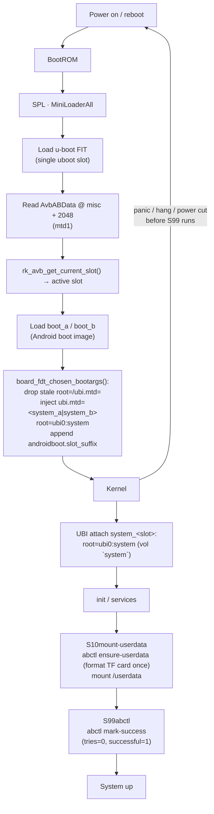

# SPI NAND 上的 A/B(双槽)启动与 OTA 升级 — Luckfox Lyra Zero W

**Lyra Zero W**(RK3506B,256 MB 板载 SPI NAND W25N02KV,无 eMMC)使用与 eMMC Lyra
Ultra W 相同的 u-boot **A/B 槽位启动**
([doc/ab-boot.md](ab-boot.md):`CONFIG_ANDROID_AB` + AVB 用户态库),但槽位放在 NAND
上,且是 UBI 卷而不是 ext4 分区。启动的系统完全跑在板载 NAND 上;**TF 卡仅作数据存储**
(`userdata`),所以切换槽位从不触碰运行时数据。

全部用 Rockchip 的现成机制配置——不改 u-boot 源码。磁盘上的槽位状态(`misc` MTD 分区
里的 `AvbABData`)是 u-boot proper 与用户态 `abctl` / `ota-update` 工具共享的唯一事实
来源。本板还启用了完整 **AMP**(第 3 颗 Cortex-A7 上跑 RT-Thread + 一颗 Cortex-M0
rpmsg responder)——见 [doc/amp.md](amp.md);本布局中的 `amp` 分区存放它需要的
amp.img FIT。

> 默认的 `lyra-zero-w-spinand` 和 `lyra-spinand` 板不受影响——这是一个独立的板级
> variant(`lyra-zero-w-spinand-ab-amp`)。

## 构建

```sh
make build   BOARD=lyra-zero-w-spinand-ab-amp   # 完整构建 -> out/firmware/
make flash   BOARD=lyra-zero-w-spinand-ab-amp   # 设备处于 loader/maskrom 模式
```

A/B `update.img` 携带**每一个**槽位分区(uboot、misc、boot_a/b、amp、system_a/b)以及
参数表。`flash.sh` 检测到 A/B 板会用 `upgrade_tool uf update.img`。新烧写的板槽位 **a**
激活(pri=15,tries=7),槽位 **b** 备用(pri=14,tries=7)。

## 存储布局

256 MB NAND 是单一 UBI 管理区域,由 u-boot 的 **mtdparts** 划分(表顺序决定内核 mtd
编号——spi-nand 上没有 master 节点,所以 `mtd0..mtd7` 与表完全一致):

| # | mtd   | 名字      | 起始(扇区) | 大小(扇区) | 大小  | 存放 |
|---|-------|-----------|---------------:|---------------:|-------|-------|
| 0 | mtd0  | uboot     | 0x2000         | 0x4000         | 8 MiB | SPL + u-boot FIT(单槽) |
| 1 | mtd1  | misc      | 0x6000         | 0x2000         | 4 MiB | AvbABData @ 字节 2048 |
| 2 | mtd2  | boot_a    | 0x8000         | 0x6000         | 12 MiB| Android boot image |
| 3 | mtd3  | boot_b    | 0xe000         | 0x6000         | 12 MiB| Android boot image |
| 4 | mtd4  | amp       | 0x14000        | 0x2000         | 4 MiB | amp.img FIT(AMP 固件) |
| 5 | mtd5  | system_a  | 0x16000        | 0x30000        | 96 MiB| rootfs UBI(卷 `system`) |
| 6 | mtd6  | system_b  | 0x46000        | 0x30000        | 96 MiB| rootfs UBI(卷 `system`) |
| 7 | mtd7  | spare     | 0x76000        | grow           | ~rest | 预留 |

分区名是 `system_a/b`(不是 `rootfs_a/b`),因为 u-boot 的
`ab_update_root_partition()` 查找 `system` 并加槽位后缀。

该布局刻意镜像 eMMC A/B 设计,只有三处 NAND 特有的差异:

- **单一 `uboot` 槽位,不是 `uboot_a`/`uboot_b`。** SPL 的槽位后缀查找在本布局上找不到
  `uboot_a`/`uboot_b`,会回退到纯 `uboot` 分区,所以 SPL 总是加载同一个 u-boot。
  A/B 由真正被升级的镜像承载——`boot_a/b` + `system_a/b`。(SPL 侧也有槽位切换机制,
  但两槽里是相同的 u-boot FIT,那样做只会给 SPL 加一个分区表依赖,却没有回滚价值。)
- **`system_a/b` 是 UBI 镜像,不是 ext4。** `vol_name=system`(见
  `config/image/ubinize-ab.cfg`)正是 u-boot 作为 `root=ubi0:system` 查找的卷名。
  `vol_flags=autoresize` 让卷在首次 attach 时填满整个 96 MiB 分区,所以同一个镜像可供
  两槽使用。
- **一个 `TYPE: GPT` 的 GPT。** loader 即使在 SPI NAND 上也写真实的 GPT(与 eMMC 一样),
  所以 u-boot 的 EFI 分区驱动(`CONFIG_SPL_EFI_PARTITION=y`)能枚举该表——不需要
  `CONFIG_RKPARM_PARTITION`。u-boot 从该表为所启动的槽位注入 `ubi.mtd=<N>`。

## 启动流程



要点:

- **这里 SPL 对 A/B 透明**:单一 `uboot` 槽位意味着 SPL 无条件启动 u-boot;槽位决策发生
  在 u-boot proper 中。
- u-boot 对尚未标记成功的槽位,每次启动将 `tries_remaining` 减一(`ab_decrease_tries()`)。
  这就是回滚的触发条件。
- u-boot 注入 `ubi.mtd=<part_num-1>` + `root=ubi0:system`,并追加
  `androidboot.slot_suffix=_a`。同一设备树服务两个槽位——内核从 `ubi.mtd=` 解析根,
  UBI 卷名 `system` 由两个槽位分区共享。
- `S99abctl` 在用户态确实启动后把所启动槽位标记为成功,停止 tries 倒计时;它只在
  `start` 时动作,所以软重启永远不会给槽位记成功。

## 升级 / 回滚策略

与 eMMC 板相同的 "successful_boot" 模型:新激活的槽位是 `priority=15, tries_remaining=7,
successful_boot=0`;每次启动失败递减 tries;tries 归零后槽位*不可启动*,u-boot 选择另一
个槽位。流程见 [doc/ab-boot.md](ab-boot.md)。

**NAND 写入路径**是不同之处:

- **system 槽位**:`ubiformat -y -f <system.ubi> /dev/mtd<system_<slot>>`
  (ubiformat 处理擦除、坏块跳过和 UBI superblock)。
- **boot 槽位**:`flash_erase` 整个分区,再 `nandwrite -p`(用 0xFF 填充到擦除块边界)。
- **misc / AvbABData**:通过裸 `/dev/mtdN` 字符设备做页级读改写(用 `MEMGETBADBLOCK`
  做坏块检查,再 `MEMERASE` + 编程),与 u-boot 的 `mtd_dwrite` 触碰同一结构体的方式
  一致。

中断的槽位写入只会损坏正在写的那个槽位;另一个槽位不受影响,仍可启动。

## 设备上的工具

`abctl` 和 `ota-update` 与 eMMC 版有相同的 CLI/JSON 契约(可被 web 调用:stdout 输出
JSON,stderr 输出日志),使用 **MTD 后端**:

- 分区来自 `/proc/mtd`(`mtd0=uboot … mtd7=spare`),不做 GPT 扫描;
- `abctl find-part <name>` 把任意分区名解析为 `/dev/mtdN`;
- TF 数据卡是唯一的 mmc 设备(`/dev/mmcblk0`)——`abctl ensure-userdata` 扫描其 GPT
  找 `userdata` 分区,首次启动格式化为 ext4,并挂载 `/userdata`(也可通过 `/data` 访问)。

| 命令 | 作用 |
|---|---|
| `abctl status` | JSON:当前槽位、各槽位 priority/tries/successful/bootable、激活的 `ubi.mtd=` 根、misc 设备 |
| `abctl mark-success` | 把所启动槽位设为 `tries=0, successful=1`(幂等) |
| `abctl set-active a\|b` | 使某槽位激活:`pri=15, tries=7, succ=0`;另一槽 → `pri=14` |
| `abctl set-other-active` | 提升*非激活*槽位(手动回滚) |
| `abctl find-part <name>` | 把分区名解析为 `/dev` 节点(mtd 或 mmc) |
| `abctl ensure-userdata` | 在 TF 卡上把 `userdata` 格式化为 ext4(仅一次),然后挂载 `/userdata` |
| `ota-update status` | 与 `abctl status` 相同的 JSON |
| `ota-update apply --rootfs f.ubi [--boot b.img] [--target a\|b] [--dry-run]` | 把 UBI/boot 镜像写入非激活槽位(或 `--target`),检查是否放得下,然后提升该槽位 |

`S10mount-userdata` 启动时运行 `ensure-userdata`;`S99abctl` 运行 `mark-success`。两者
都限定在 zero-W A/B overlay 内。

示例:

```sh
ota-update apply --rootfs /userdata/ota/system_a.ubi
# {"ok": true, "slot": "b", "note": "reboot to boot the new slot; a failed boot rolls back"}
reboot
```

## 如何接入 SDK

所有 NAND A/B 内容都限定在 `lyra-zero-w-spinand-ab-amp` 板;默认的
`lyra-zero-w-spinand` 板逐字节不变。

- **板配置** — `config/boards/lyra-zero-w-spinand-ab-amp.mk`
  (`AB := 1`、`AMP := 1`、`STORAGE := spinand`、`ROOTFS_TYPE := ubi`)。
- **分区表** — `config/image/parameter-lyra-spinand-ab-amp.txt`
  (`TYPE: GPT`,`CMDLINE:` 里有 `mtdparts`)。
- **u-boot** — `product/platform/configs/uboot/rk3506b_luckfox_ab_amp.config`
  (`CONFIG_ANDROID_AB` + AVB 库 + `CONFIG_AMP`/`CONFIG_ROCKCHIP_AMP`;无
  `CONFIG_RKPARM_PARTITION` —— loader 在 NAND 上写真实 GPT,所以 EFI 分区驱动提供该
  表)。该 fragment 与 eMMC AMP 板共享。
- **设备树** — `product/platform/dts/rk3506b-luckfox-lyra-zero-w-ab-amp.dts`
  (无固定 `root=`/`ubi.mtd=`:u-boot 按槽位注入;包含 `rk3506-amp.dtsi` + `amp_reserved`
  区域)。
- **Buildroot** — `product/platform/configs/buildroot/rockchip_rk3506_luckfox_ab_amp_defconfig`
  (精简核心、UBI 卷 `system`、mtd-utils + e2fsprogs + python3 供工具使用)。
- **UBI 镜像** — `config/image/ubinize-ab.cfg`(`vol_name=system`、
  `vol_flags=autoresize`);rootfs 阶段以 `fs/ubi/ubinize-ab.cfg` 暂存。
- **固件组装** — `stages/40-firmware/run.sh` 构建 AMP 镜像,把 `boot.img`→`boot_a/b`、
  `rootfs.img`→`system_a/b`(UBI 镜像)复制,生成 `misc.img`
  (`tools/scripts/mkabmeta.py`),并打包一个列出所有槽位分区加 `amp` 的 update.img。
- **Rootfs overlay** — `product/platform/rootfs/overlay-lyra-zero-w-spinand-ab-amp/`
  携带 `abctl`、`ota-update`、`m0ping` 和 `S10`/`S99` init 脚本;由 `post-rootfs.sh`
  (`overlay-$TARGET`)合并。

## 验证状态

**已在实体 Zero W 上硬件验证(2026-08-16/17)。** NAND 存储路径在硅片上工作:u-boot 从
`misc` 读 `AvbABData`,选择激活槽位,注入 `ubi.mtd=<N> root=ubi0:system`,内核 attach
对应的 UBI 卷(已验证从 `system_b`、`mtd6` 启动槽位 **b**)。同一块板上的 AMP 栈(cpu2
上的 RT-Thread + M0 rpmsg responder + `m0ping`)也已验证。完整记录——包括烧写流程
(≥32 MB rockusb 读掩码绕行)、M0 POR-only 行为和陈旧 DDR 误诊——在
[test-record-zero-w.md](test-record-zero-w.md)。硬件上发现的已知缺陷:`abctl` 崩溃,因为
精简 rootfs 丢掉了 python3 的 `zlib` 模块(已在 AMP defconfig 中修复)。

## 设计说明 / 限制

- **无 verified boot**:libavb 存在,但 vbmeta 密钥验证关闭——A/B 元数据在没有信任链
  的情况下工作(与 eMMC 板相同)。
- **NAND 写放大 / 磨损**:OTA 写入触碰整个槽位(`ubiformat` 擦除每个块)。每槽 96 MiB,
  对偶尔升级的设备而言典型耐用度可接受;差分/增量 payload 留作未来工作。
- **misc 页面 RMW**:AvbABData 位于一个 NAND 页内;读改写是安全的,因为该页是其擦除块
  里唯一的活动内容。写入中途断电最多丢失元数据(misc 永不启动),且如果 CRC 损坏,
  `abctl` 报告 `metadata_valid: false` 而不是瞎猜。
- **Payload 格式**:`ota-update` 目前接收原始槽位镜像。版本检查、签名和差分 payload 是
  同一个 CLI 后面的未来工作。
