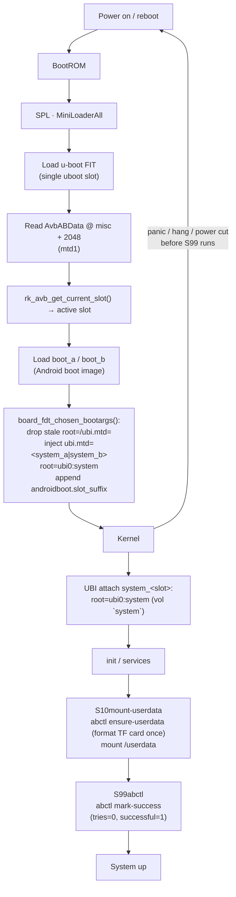

# A/B (dual-slot) boot & OTA upgrade on SPI NAND — Luckfox Lyra Zero W

The **Lyra Zero W** (RK3506B, 256 MB onboard SPI NAND W25N02KV, no eMMC)
carries the same u-boot **A/B slot boot** as the eMMC Lyra Ultra W
([doc/ab-boot.md](ab-boot.md): `CONFIG_ANDROID_AB` + the AVB user-space libs),
but the slots live on NAND and are UBI volumes rather than ext4 partitions.
The booted system runs entirely from the onboard NAND; the **TF card is
data-only** (`userdata`), so a slot switch never touches runtime data.

Everything is configured with Rockchip's stock machinery — no u-boot source
changes.  The on-disk slot state (`AvbABData` in the `misc` MTD partition) is
the single source of truth shared by u-boot proper and the user-space `abctl` /
`ota-update` tools.  This board also enables full **AMP** (RT-Thread on the 3rd
Cortex-A7 + a Cortex-M0 rpmsg responder) — see [doc/amp.md](amp.md); the `amp`
partition in this layout holds the amp.img FIT it needs.

> The default `lyra-zero-w-spinand` and `lyra-spinand` boards are untouched —
> this is a separate board variant (`lyra-zero-w-spinand-ab-amp`).

## Building

```sh
make build   BOARD=lyra-zero-w-spinand-ab-amp   # full build -> out/firmware/
make flash   BOARD=lyra-zero-w-spinand-ab-amp   # device in loader/maskrom mode
```

The A/B `update.img` carries **every** slot partition (uboot, misc, boot_a/b,
amp, system_a/b) plus the parameter table.  `flash.sh` detects the A/B board
and uses `upgrade_tool uf update.img`.  A fresh flash has slot **a** active
(pri=15, tries=7) and slot **b** as standby (pri=14, tries=7).

## Storage layout

The 256 MB NAND is a single UBI-managed region split by u-boot's **mtdparts**
(table order defines the kernel mtd numbering — there is no master node on
spi-nand, so `mtd0..mtd7` match the table exactly):

| # | mtd   | name      | start (sector) | size (sectors) | size  | holds |
|---|-------|-----------|---------------:|---------------:|-------|-------|
| 0 | mtd0  | uboot     | 0x2000         | 0x4000         | 8 MiB | SPL + u-boot FIT (single slot) |
| 1 | mtd1  | misc      | 0x6000         | 0x2000         | 4 MiB | AvbABData @ byte 2048 |
| 2 | mtd2  | boot_a    | 0x8000         | 0x6000         | 12 MiB| Android boot image |
| 3 | mtd3  | boot_b    | 0xe000         | 0x6000         | 12 MiB| Android boot image |
| 4 | mtd4  | amp       | 0x14000        | 0x2000         | 4 MiB | amp.img FIT (AMP firmware) |
| 5 | mtd5  | system_a  | 0x16000        | 0x30000        | 96 MiB| rootfs UBI (volume `system`) |
| 6 | mtd6  | system_b  | 0x46000        | 0x30000        | 96 MiB| rootfs UBI (volume `system`) |
| 7 | mtd7  | spare     | 0x76000        | grow           | ~rest | reserved |

Partition names are `system_a/b` (not `rootfs_a/b`) because u-boot's
`ab_update_root_partition()` looks up `system` and slot-suffixes it.

The layout deliberately mirrors the eMMC A/B design with three NAND-specific
differences:

- **A single `uboot` slot, not `uboot_a`/`uboot_b`.**  SPL's slot-suffix
  lookup finds no `uboot_a`/`uboot_b` on this layout and falls back to the
  plain `uboot` partition, so SPL always loads the same u-boot.  A/B is
  carried by the images that actually get upgraded — `boot_a/b` +
  `system_a/b`.  (The SPL-side slot switch exists, but with identical u-boot
  FITs in both slots it would add an SPL partition-table dependency for no
  rollback value.)
- **`system_a/b` are UBI images, not ext4.**  `vol_name=system` (see
  `config/image/ubinize-ab.cfg`) is what u-boot looks up as
  `root=ubi0:system`.  `vol_flags=autoresize` lets the volume fill the whole
  96 MiB partition on first attach, so the same image serves both slots.
- **A GPT for `TYPE: GPT`.**  The loader writes a real GPT even on SPI NAND
  (as on eMMC), so u-boot's EFI partition driver (`CONFIG_SPL_EFI_PARTITION=y`)
  enumerates the table — no `CONFIG_RKPARM_PARTITION` needed.  u-boot injects
  `ubi.mtd=<N>` from that table for the booted slot.

## Boot flow



Key points:

- **SPL is A/B-transparent here**: a single `uboot` slot means SPL boots
  u-boot unconditionally; the slot decision happens in u-boot proper.
- u-boot decrements `tries_remaining` once per boot of a slot not yet marked
  successful (`ab_decrease_tries()`).  This is the rollback trigger.
- u-boot injects `ubi.mtd=<part_num-1>` + `root=ubi0:system` and appends
  `androidboot.slot_suffix=_a`.  The same device tree serves both slots — the
  kernel resolves the root from `ubi.mtd=`, and the UBI volume name `system`
  is shared by both slot partitions.
- `S99abctl` marks the booted slot successful once userspace demonstrably
  boots, stopping the tries countdown; it acts only on `start`, so a soft
  reboot never credits a slot.

## Upgrade / rollback policy

Identical "successful_boot" model to the eMMC board: a freshly activated slot
is `priority=15, tries_remaining=7, successful_boot=0`; every failed boot
decrements tries; once tries hit zero the slot is *unbootable* and u-boot
selects the other slot.  See [doc/ab-boot.md](ab-boot.md) for the flow.

The **NAND write path** is what differs:

- **system slot**: `ubiformat -y -f <system.ubi> /dev/mtd<system_<slot>>`
  (ubiformat handles erase, bad-block skipping and the UBI superblock).
- **boot slot**: `flash_erase` the whole partition, then `nandwrite -p`
  (pads to the erase-block boundary with 0xFF).
- **misc / AvbABData**: a page read-modify-write through the raw `/dev/mtdN`
  char device (bad-block checked with `MEMGETBADBLOCK`, then `MEMERASE` +
  program), mirroring how u-boot's `mtd_dwrite` touches the same struct.

An interrupted slot write only corrupts the slot being written; the other slot
is untouched and remains bootable.

## Tools on the device

`abctl` and `ota-update` have the same CLI/JSON contract as the eMMC variants
(web-callable: JSON on stdout, logs on stderr), with **MTD backends**:

- partitions come from `/proc/mtd` (`mtd0=uboot … mtd7=spare`), not GPT
  scanning;
- `abctl find-part <name>` resolves any partition name to `/dev/mtdN`;
- the TF data card is the only mmc device (`/dev/mmcblk0`) — `abctl
  ensure-userdata` scans its GPT for a `userdata` partition, formats it ext4 on
  first boot, and mounts `/userdata` (also reachable as `/data`).

| command | effect |
|---|---|
| `abctl status` | JSON: current slot, per-slot priority/tries/successful/bootable, active `ubi.mtd=` root, misc device |
| `abctl mark-success` | set the booted slot `tries=0, successful=1` (idempotent) |
| `abctl set-active a\|b` | make a slot active: `pri=15, tries=7, succ=0`; other → `pri=14` |
| `abctl set-other-active` | promote the *inactive* slot (manual rollback) |
| `abctl find-part <name>` | resolve a partition name to a `/dev` node (mtd or mmc) |
| `abctl ensure-userdata` | format `userdata` (ext4) on the TF card once, then mount `/userdata` |
| `ota-update status` | same JSON as `abctl status` |
| `ota-update apply --rootfs f.ubi [--boot b.img] [--target a\|b] [--dry-run]` | write UBI/boot images into the inactive slot (or `--target`), check they fit, then promote the slot |

`S10mount-userdata` runs `ensure-userdata` at boot; `S99abctl` runs
`mark-success`.  Both are scoped to the zero-W A/B overlay.

Example:

```sh
ota-update apply --rootfs /userdata/ota/system_a.ubi
# {"ok": true, "slot": "b", "note": "reboot to boot the new slot; a failed boot rolls back"}
reboot
```

## How this is wired into the SDK

All NAND A/B bits are scoped to the `lyra-zero-w-spinand-ab-amp` board; the
default `lyra-zero-w-spinand` board is byte-for-byte unchanged.

- **Board config** — `config/boards/lyra-zero-w-spinand-ab-amp.mk`
  (`AB := 1`, `AMP := 1`, `STORAGE := spinand`, `ROOTFS_TYPE := ubi`).
- **Partition table** — `config/image/parameter-lyra-spinand-ab-amp.txt`
  (`TYPE: GPT`, `mtdparts` in the `CMDLINE:`).
- **u-boot** — `product/platform/configs/uboot/rk3506b_luckfox_ab_amp.config`
  (`CONFIG_ANDROID_AB` + AVB libs + `CONFIG_AMP`/`CONFIG_ROCKCHIP_AMP`; no
  `CONFIG_RKPARM_PARTITION` — the loader writes a real GPT on NAND, so the EFI
  partition driver serves the table).  The fragment is shared with the eMMC
  AMP board.
- **Device tree** — `product/platform/dts/rk3506b-luckfox-lyra-zero-w-ab-amp.dts`
  (no fixed `root=`/`ubi.mtd=`: u-boot injects them per slot; includes
  `rk3506-amp.dtsi` + the `amp_reserved` region).
- **Buildroot** — `product/platform/configs/buildroot/rockchip_rk3506_luckfox_ab_amp_defconfig`
  (slim core, UBI volume `system`, mtd-utils + e2fsprogs + python3 for the
  tooling).
- **UBI image** — `config/image/ubinize-ab.cfg` (`vol_name=system`,
  `vol_flags=autoresize`); staged as `fs/ubi/ubinize-ab.cfg` by the rootfs
  stage.
- **Firmware assembly** — `stages/40-firmware/run.sh` builds the AMP images,
  duplicates `boot.img`→`boot_a/b`, `rootfs.img`→`system_a/b` (the UBI image),
  generates `misc.img` (`tools/scripts/mkabmeta.py`) and packs an update.img
  listing all slot partitions plus `amp`.
- **Rootfs overlay** — `product/platform/rootfs/overlay-lyra-zero-w-spinand-ab-amp/`
  ships `abctl`, `ota-update`, `m0ping` and the `S10`/`S99` init scripts;
  merged by `post-rootfs.sh` (`overlay-$TARGET`).

## Verification status

**Build-only so far.**  The AMP/SoC-side pieces (u-boot AMP release, M0
responder, rpmsg ping-pong) are verified on the eMMC hardware verification bed
(`lyra-ultra-w-emmc-ab-amp`, same RK3506B SoC) — see
[doc/amp.md](amp.md#hardware-verification).  The NAND storage path (UBI slots,
MTD abctl/ota-update, TF-card userdata) has **not yet been exercised on a
physical Zero W**; that requires the board.  The build itself is the current
checkpoint.

## Design notes / limitations

- **No verified boot**: libavb is present but vbmeta key validation is off —
  A/B metadata works without a chain of trust (same as the eMMC board).
- **NAND write amplification / wear**: OTA writes touch the whole slot
  (`ubiformat` erases every block).  With 96 MiB per slot and typical
  endurance this is acceptable for a device that is upgraded occasionally; a
  differential/delta payload is future work.
- **misc page RMW**: AvbABData lives in one NAND page; the read-modify-write
  is safe because the page is the only live content in its erase block.  A
  power cut mid-write can only lose the metadata (misc is never booted), and
  `abctl` reports `metadata_valid: false` if the CRC is broken rather than
  guessing.
- **Payload format**: `ota-update` currently takes raw slot images.  Version
  checks, signing and differential payloads are future work behind the same
  CLI.
