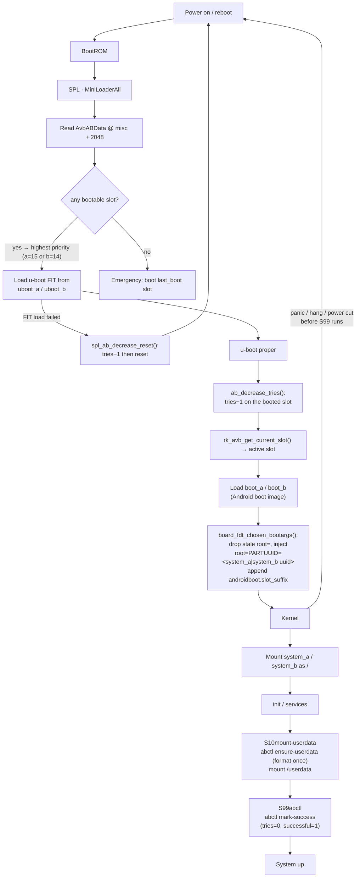
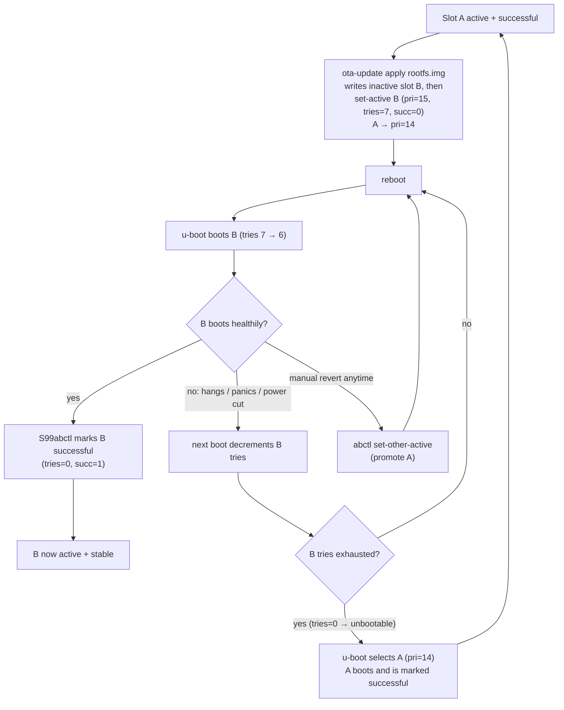
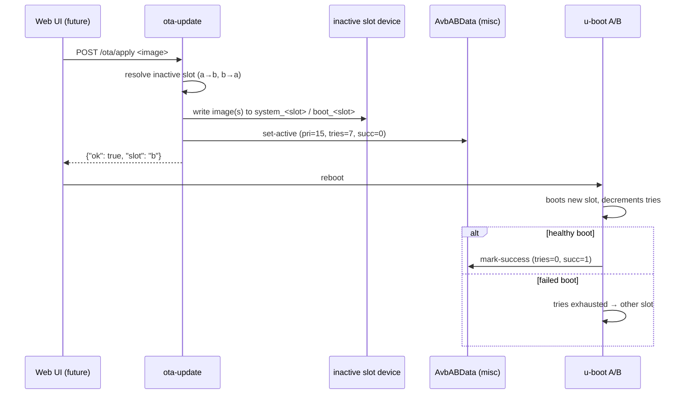

# A/B (dual-slot) boot & OTA upgrade — Luckfox Lyra Ultra W

The Lyra Ultra W (RK3506) normally boots a single `uboot` / `boot` / `rootfs`
layout — an OTA update is all-or-nothing and a bad image bricks the board until
it is re-flashed over USB.  This board variant (`lyra-ultra-w-emmc-ab`) enables
**u-boot's native A/B slot boot** (`CONFIG_ANDROID_AB` + the AVB user-space
libs + SPL A/B), so firmware is upgraded in place and a failed boot **rolls
back automatically** to the previous slot.

Everything is configured with Rockchip's stock machinery — no u-boot source
changes.  The on-disk slot state (`AvbABData` in the `misc` partition) is the
single source of truth shared by SPL, u-boot proper and the user-space
`abctl` / `ota-update` tools.

> The default `lyra-ultra-w-emmc` board is untouched — this is a separate
> board variant, so both can coexist in one build.

## Building

```sh
make build   BOARD=lyra-ultra-w-emmc-ab    # full build -> out/firmware/
make flash   BOARD=lyra-ultra-w-emmc-ab    # device in loader/maskrom mode
```

The A/B `update.img` carries **every** slot partition (uboot_a/b, boot_a/b,
system_a/b, misc) plus the parameter table; `flash.sh` detects the A/B board
and uses `upgrade_tool uf update.img` (the `di -uboot/-b/-rootfs` flags cannot
address slot copies).  A fresh flash has slot **a** active (pri=15, tries=7)
and slot **b** as standby (pri=14, tries=7).

## Boot flow



Key points:

- **SPL A/B** (`CONFIG_SPL_AB=y`) is dormant until a `misc` partition exists;
  with it present every partition lookup is slot-suffixed (`uboot` →
  `uboot_a`/`uboot_b`), and SPL picks the slot from `AvbABData`.
- **u-boot proper** decrements `tries_remaining` once per boot of a slot that
  has not yet been marked successful (`ab_decrease_tries()` in `board_init`).
  This is the kernel-level rollback trigger.
- u-boot injects `root=PARTUUID=<active system slot uuid>` and appends
  `androidboot.slot_suffix=_a` to the kernel cmdline.  The **same device tree
  and fstab** serve both slots — the kernel resolves `/dev/root` from `root=`.
- `S99abctl` marks the booted slot successful once the system demonstrably
  boots, stopping the tries countdown.  A slot whose boot keeps failing before
  userspace runs never gets marked and expires.  The script acts **only on
  `start`** (init calls it via `rcS`): on shutdown (`rcK` calls `S99abctl
  stop`) it does nothing, so a soft reboot never credits a slot as
  successful.

## Upgrade / rollback policy (the "successful_boot" model)

A freshly activated slot is `priority=15, tries_remaining=7, successful_boot=0`;
the other slot drops to `priority=14`.  Every boot of a not-yet-successful slot
decrements tries (in u-boot).  The slot is **marked successful** once the
system comes up.  If tries run out (boot keeps failing before userspace), the
slot becomes *unbootable* and u-boot selects the other slot.



- **Automatic rollback**: install a bad slot, reboot, watch it fail, and the
  previous slot comes back up on its own.
- **Manual rollback**: `abctl set-other-active` then reboot (e.g. a slot that
  boots but misbehaves later).
- **Power-loss safe**: an interrupted slot write only corrupts the slot being
  written; the other slot is untouched and remains bootable.
- **Shared state**: `userdata` (mounted at `/userdata`, symlinked as `/data`)
  is outside the slots, so a switch never touches runtime data or web-UI state.

## OTA entry point (web-ready)

`ota-update` is the upgrade CLI and is deliberately web-callable: JSON on
stdout, progress on stderr, no state of its own.  A future web UI only needs to
upload an image and exec it.



## Partition layout — `config/image/parameter-lyra-emmc-ab.txt`

512-byte sectors, GPT (eMMC → `mmcblk0p1..p8`).  The `uuid:` lines give
`system_a` / `system_b` / `userdata` stable PARTUUIDs, which is how u-boot
injects `root=PARTUUID=` for the booted slot.

| # | name      | start (sector) | size (sectors) | size      | holds |
|---|-----------|---------------:|---------------:|-----------|-------|
| 1 | uboot_a   | 0x2000         | 0x2000         | 4 MiB     | SPL + u-boot FIT |
| 2 | uboot_b   | 0x4000         | 0x2000         | 4 MiB     | SPL + u-boot FIT |
| 3 | misc      | 0x6000         | 0x2000         | 4 MiB     | AvbABData @ 2048 |
| 4 | boot_a    | 0x8000         | 0x6000         | 12 MiB    | Android boot image |
| 5 | boot_b    | 0xe000         | 0x6000         | 12 MiB    | Android boot image |
| 6 | system_a  | 0x14000        | 0x200000       | 1 GiB     | rootfs (ext4) |
| 7 | system_b  | 0x214000       | 0x200000       | 1 GiB     | rootfs (ext4) |
| 8 | userdata  | 0x414000       | grow           | ~rest     | shared runtime data |

Partition names are `system_a/b` (not `rootfs_a/b`) because u-boot's
`ab_update_root_partition()` looks up `system` and slot-suffixes it.

## AvbABData — the shared metadata

A 32-byte struct, big-endian, stored at **byte offset 2048** of the `misc`
partition (`AB_METADATA_OFFSET`; matches `include/android_avb/avb_ab_flow.h`):

```
offset  size  field
0       4     magic      "\0AB0"
4       1     version_major    1
5       1     version_minor    0
6       2     reserved
8       4     slot a     priority | tries_remaining | successful_boot | reserved
12      4     slot b     priority | tries_remaining | successful_boot | reserved
16      1     last_boot  (emergency fallback slot)
17      11    reserved
28      4     crc32      big-endian CRC32 of bytes 0..27
```

Initial (fresh flash) values — identical to u-boot's `avb_ab_data_init()` and
what `tools/scripts/mkabmeta.py` generates:

| field | value |
|---|---|
| slot a | priority=15, tries=7, successful=0 |
| slot b | priority=14, tries=7, successful=0 |
| last_boot | 0 |

`successful_boot=1` is only ever written together with `tries_remaining=0`; a
slot with `tries>0 && successful` is treated as *unbootable* by u-boot.

## Tools on the device

### `abctl` — boot control (root)

Reads/writes `AvbABData` via the `misc` partition and parses the GPT directly
(the rootfs has no udev), so it works with no extra packages.

| command | effect |
|---|---|
| `abctl status` | JSON: current slot, per-slot priority/tries/successful/bootable, active `root=PARTUUID`, misc device |
| `abctl mark-success` | set the booted slot `tries=0, successful=1` (idempotent) |
| `abctl set-active a\|b` | make a slot active: `pri=15, tries=7, succ=0`; other → `pri=14` |
| `abctl set-other-active` | promote the *inactive* slot (manual rollback) |
| `abctl find-part <name>` | resolve a GPT partition name → `/dev/mmcblkNpM` |
| `abctl ensure-userdata` | format `userdata` (ext4) on first boot, then mount `/userdata` |

`S10mount-userdata` runs `ensure-userdata` at boot; `S99abctl` runs
`mark-success`.

### `ota-update` — upgrade entry point

| command | effect |
|---|---|
| `ota-update status` | same JSON as `abctl status` |
| `ota-update apply --rootfs f.img [--boot b.img] [--target a\|b] [--dry-run]` | write images into the inactive slot (or `--target`), check they fit, then promote the slot |

Example:

```sh
ota-update apply --rootfs /userdata/ota/rootfs.img
# {"ok": true, "slot": "b", "note": "reboot to boot the new slot; a failed boot rolls back"}
reboot
```

## Flashing

`flash.sh` detects the A/B board (`AB := 1` in the board config) and flashes
the whole image: `upgrade_tool uf update.img`.  The device must be in loader or
maskrom mode (`make flash` prints how).  Re-flashing is always possible — the
loader's USB download function is always present, even with a broken rootfs.

## How this is wired into the SDK

All A/B bits are scoped to the `lyra-ultra-w-emmc-ab` board; the default
`lyra-ultra-w-emmc` board is byte-for-byte unchanged.

- **Board config** — `config/boards/lyra-ultra-w-emmc-ab.mk` sets
  `AB := 1`, the A/B u-boot fragment, the A/B device tree, the A/B buildroot
  defconfig and the A/B parameter file.
- **Partition table** — `config/image/parameter-lyra-emmc-ab.txt`
  (8 partitions + `uuid:` PARTUUID lines).
- **u-boot** — `product/platform/configs/uboot/rk3506b_luckfox_ab.config`
  (mirrors Rockchip's `rv1126-ab.config`: `CONFIG_ANDROID_AB` + the AVB
  user-space libs; no vbmeta key verification, so no signing chain is needed).
- **Device tree** — `product/platform/dts/rk3506b-luckfox-lyra-ultra-w-ab.dts`
  (no fixed `root=`: u-boot injects `root=PARTUUID` per slot).
- **Buildroot** — `product/platform/configs/buildroot/rockchip_rk3506_luckfox_ab_defconfig`
  (default + e2fsprogs for the userdata auto-format).
- **Firmware assembly** — `stages/40-firmware/run.sh` duplicates slot images,
  generates `misc.img` (`tools/scripts/mkabmeta.py`) and packs an update.img
  listing all slot partitions.
- **Rootfs overlay** — `product/platform/rootfs/overlay-lyra-ultra-w-emmc-ab/`
  ships `abctl`, `ota-update` and the `S10`/`S99` init scripts; merged by
  `post-rootfs.sh` (`overlay-$TARGET`).
- **Flashing** — `tools/scripts/flash.sh` uses `upgrade_tool uf` for A/B
  boards.

## Hardware verification (2026-08-13)

All three upgrade/rollback paths were exercised on a physical Lyra Ultra W
(serial `/dev/ttyACM2` @ 1.5 Mbaud, USB CDC-ECM network `192.168.123.100`,
boot logs captured over serial, metadata read back over SSH):

1. **`ota-update apply` → boots the new slot.** An image was written to the
   inactive `system_b`, the slot promoted, and on reboot u-boot selected `_b`
   (`root=PARTUUID=d7891b4a…`, `androidboot.slot_suffix=_b`); the rootfs was
   resized on first boot and its marker file was present. u-boot had
   decremented `_b` tries 7 → 6.
2. **Automatic rollback on a failed slot.** `uboot_a` was zeroed and slot a set
   to `tries=1`. Reboot: SPL picked `_a` and the u-boot FIT load failed
   (`Not fit magic`) → `spl_ab_decrease_reset()` decremented tries 1 → 0 and
   reset the board — then SPL picked `_b` and booted it. No user action, no
   re-flash. After the fallback the metadata read exactly as designed:
   `a=(0,0,0)` (unbootable), `b=(14,0,1)` (successful).
3. **Manual rollback (`abctl set-other-active`).** From slot b, promoted a
   (`a=(15,7,0)`, `b=(14,7,0)`); on reboot SPL loaded the restored `uboot_a`,
   booted `system_a` (`root=PARTUUID=f372dce4…`) and `S99abctl` marked it
   successful → `a=(15,0,1)`, `b=(14,7,0)`.

Two bugs were found and fixed while testing:

- **`S99abctl` marked the slot successful on shutdown.** The script had no
  `case "$1" in`, so at shutdown `/etc/init.d/rcK` ran `S99abctl stop`, which
  ran `mark-success` unconditionally — a soft reboot credited the slot for
  merely reaching init and broke the tries countdown (and with it automatic
  rollback).  Fixed by acting only on `start`.
- **`abctl status` crashed on the first flashed image** (a Python ternary
  precedence bug in `load_status`).  Fixed; the corrected `abctl` was also
  written into both on-disk rootfs.

Device state left after the tests: slot **a** active and successful (`15,0,1`),
slot **b** a clean standby (`14,7,0`), `uboot_a`/`uboot_b` identical
(restored), `userdata` mounted at `/userdata`.

## Design notes / limitations

- **No verified boot**: `libavb` is present but vbmeta key validation is off —
  the A/B metadata works without a chain of trust.  Adding AVB signing is a
  separate project and does not change the storage layer.
- **Payload format**: `ota-update` currently takes raw slot images.  Version
  checks, signing and differential payloads are future work and can sit behind
  the same CLI.
- **Web UI**: not included (out of scope) — `ota-update` is the boundary a
  future HTTP handler calls.
