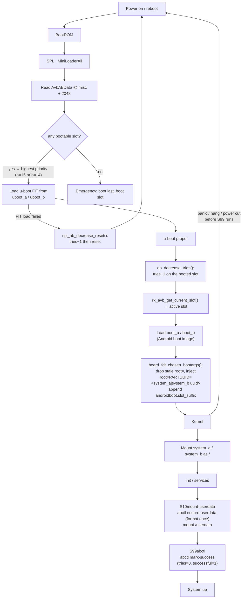
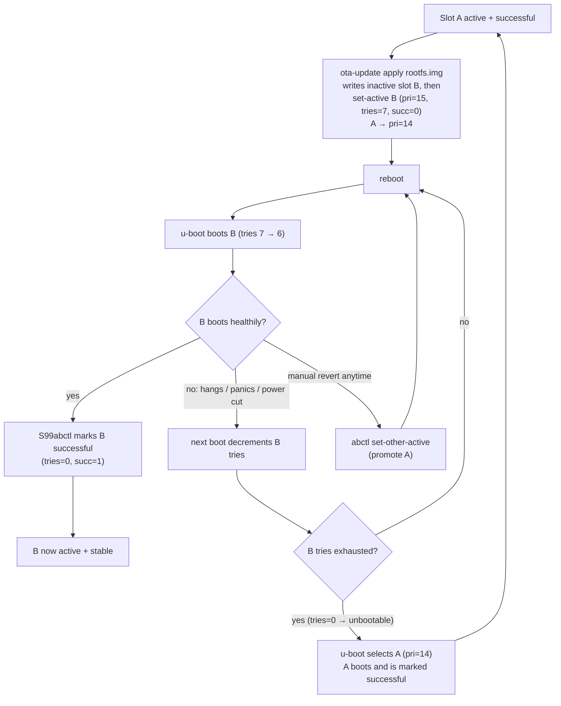
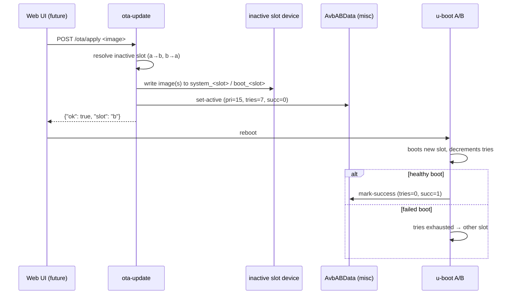

# A/B(双槽位)启动与 OTA 升级 —— Luckfox Lyra Ultra W

Lyra Ultra W(RK3506)通常以单一 `uboot` / `boot` / `rootfs` 布局启动——OTA 更新是全有或全无的,坏镜像会让板子变砖,直到通过 USB 重新烧写。该板型变体(`lyra-ultra-w-emmc-ab`)启用了 **u-boot 原生的 A/B 槽位启动**(`CONFIG_ANDROID_AB` + AVB 用户空间库 + SPL A/B),因此固件可以就地升级,启动失败时会**自动回滚**到上一个槽位。

所有内容都使用 Rockchip 的官方机制配置——无需修改 u-boot 源码。磁盘上的槽位状态(`misc` 分区中的 `AvbABData`)是 SPL、u-boot proper 与用户空间 `abctl` / `ota-update` 工具共同依赖的唯一事实来源。

> 默认的 `lyra-ultra-w-emmc` 板不受影响——这是一个独立的板型变体,因此两者可以在一次构建中并存。

## 构建

```sh
make build   BOARD=lyra-ultra-w-emmc-ab    # full build -> out/firmware/
make flash   BOARD=lyra-ultra-w-emmc-ab    # device in loader/maskrom mode
```

A/B 的 `update.img` 包含**所有**槽位分区(uboot_a/b、boot_a/b、system_a/b、misc)以及参数表;`flash.sh` 会检测 A/B 板并使用 `upgrade_tool uf update.img`(`di -uboot/-b/-rootfs` 这些 flag 无法寻址槽位副本)。全新烧写后,槽位 **a** 为活动槽(pri=15、tries=7),槽位 **b** 为备用槽(pri=14、tries=7)。

## 启动流程



要点:

- **SPL A/B**(`CONFIG_SPL_AB=y`)在 `misc` 分区存在之前处于休眠状态;存在时,每次分区查找都会带上槽位后缀(`uboot` → `uboot_a`/`uboot_b`),SPL 从 `AvbABData` 中选择槽位。
- **u-boot proper** 对尚未标记为成功的槽位,每次启动都会将 `tries_remaining` 减一(`board_init` 中的 `ab_decrease_tries()`)。这是内核层面的回滚触发机制。
- u-boot 会注入 `root=PARTUUID=<active system slot uuid>`,并向内核命令行追加 `androidboot.slot_suffix=_a`。**同一个设备树和 fstab** 服务于两个槽位——内核从 `root=` 解析 `/dev/root`。
- 一旦系统确实启动起来,`S99abctl` 就将已启动的槽位标记为成功,从而停止 tries 倒计时。在用户空间运行之前启动一直失败的槽位永远不会被标记,并最终失效。该脚本**只在 `start` 时执行动作**(init 通过 `rcS` 调用它):在关机时(`rcK` 调用 `S99abctl stop`)它什么都不做,因此软重启永远不会把槽位计为成功。

## 升级/回滚策略(“successful_boot”模型)

新激活的槽位是 `priority=15, tries_remaining=7, successful_boot=0`;另一个槽位降为 `priority=14`。尚未成功的槽位每启动一次,tries 都会减一(在 u-boot 中完成)。系统起来后,该槽位就会被**标记为成功**。如果 tries 耗尽(在用户空间运行前启动一直失败),该槽位将变为*不可启动*,u-boot 会选择另一个槽位。



- **自动回滚**:安装一个有问题的槽位,重启,看它失败,然后上一个槽位会自行恢复启动。
- **手动回滚**:执行 `abctl set-other-active` 然后重启(例如某个槽位能启动但之后行为异常)。
- **断电安全**:槽位写入被中断只会损坏正在写入的那个槽位;另一个槽位不受影响,仍然可以启动。
- **状态共享**:`userdata`(挂载在 `/userdata`,符号链接为 `/data`)位于槽位之外,因此切换槽位绝不会影响运行时数据或 web-UI 状态。

## OTA 入口(web 就绪)

`ota-update` 是升级 CLI,并且刻意设计为可被 web 调用:JSON 输出到 stdout,进度输出到 stderr,自身不保存任何状态。未来的 web UI 只需要上传镜像并执行它即可。



## 分区布局 —— `config/image/parameter-lyra-emmc-ab.txt`

512 字节扇区,GPT(eMMC → `mmcblk0p1..p8`)。`uuid:` 行赋予 `system_a` / `system_b` / `userdata` 稳定的 PARTUUID,这正是 u-boot 为已启动槽位注入 `root=PARTUUID=` 的方式。

| # | 名称 | 起始(扇区) | 大小(扇区) | 大小 | 存放内容 |
|---|-----------|---------------:|---------------:|-----------|-------|
| 1 | uboot_a   | 0x2000         | 0x2000         | 4 MiB     | SPL + u-boot FIT |
| 2 | uboot_b   | 0x4000         | 0x2000         | 4 MiB     | SPL + u-boot FIT |
| 3 | misc      | 0x6000         | 0x2000         | 4 MiB     | AvbABData @ 2048 |
| 4 | boot_a    | 0x8000         | 0x6000         | 12 MiB    | Android boot image |
| 5 | boot_b    | 0xe000         | 0x6000         | 12 MiB    | Android boot image |
| 6 | system_a  | 0x14000        | 0x200000       | 1 GiB     | rootfs (ext4) |
| 7 | system_b  | 0x214000       | 0x200000       | 1 GiB     | rootfs (ext4) |
| 8 | userdata  | 0x414000       | grow           | ~rest     | 共享运行时数据 |

分区名是 `system_a/b`(不是 `rootfs_a/b`),因为 u-boot 的 `ab_update_root_partition()` 会查找 `system` 并为其加上槽位后缀。

## AvbABData —— 共享元数据

一个 32 字节的结构体,大端序,存储在 `misc` 分区的**字节偏移 2048** 处(`AB_METADATA_OFFSET`;与 `include/android_avb/avb_ab_flow.h` 一致):

```
offset  size  field
0       4      magic      "\0AB0"
4       1      version_major    1
5       1      version_minor    0
6       2      reserved
8       4      slot a     priority | tries_remaining | successful_boot | reserved
12      4      slot b     priority | tries_remaining | successful_boot | reserved
16      1      last_boot  (emergency fallback slot)
17      11     reserved
28      4      crc32      big-endian CRC32 of bytes 0..27
```

初始(全新烧写)值——与 u-boot 的 `avb_ab_data_init()` 以及 `tools/scripts/mkabmeta.py` 生成的值一致:

| 字段 | 值 |
|---|---|
| slot a | priority=15, tries=7, successful=0 |
| slot b | priority=14, tries=7, successful=0 |
| last_boot | 0 |

`successful_boot=1` 只会与 `tries_remaining=0` 一起写入;`tries>0 && successful` 的槽位会被 u-boot 视为*不可启动*。

## 设备上的工具

### `abctl` —— 启动控制(root)

通过 `misc` 分区读写 `AvbABData`,并直接解析 GPT(rootfs 中没有 udev),因此无需额外软件包即可工作。

| 命令 | 作用 |
|---|---|
| `abctl status` | JSON:当前槽位、各槽位的 priority/tries/successful/bootable、活动 `root=PARTUUID`、misc 设备 |
| `abctl mark-success` | 将已启动槽位设为 `tries=0, successful=1`(幂等) |
| `abctl set-active a\|b` | 使某槽位成为活动槽:`pri=15, tries=7, succ=0`;另一个 → `pri=14` |
| `abctl set-other-active` | 提升*非活动*槽位(手动回滚) |
| `abctl find-part <name>` | 将 GPT 分区名解析为 → `/dev/mmcblkNpM` |
| `abctl ensure-userdata` | 首次启动时格式化 `userdata`(ext4),然后挂载 `/userdata` |

`S10mount-userdata` 在启动时执行 `ensure-userdata`;`S99abctl` 执行 `mark-success`。

### `ota-update` —— 升级入口

| 命令 | 作用 |
|---|---|
| `ota-update status` | 与 `abctl status` 相同的 JSON |
| `ota-update apply --rootfs f.img [--boot b.img] [--target a\|b] [--dry-run]` | 将镜像写入非活动槽位(或 `--target` 指定的槽位),检查大小是否合适,然后提升该槽位 |

示例:

```sh
ota-update apply --rootfs /userdata/ota/rootfs.img
# {"ok": true, "slot": "b", "note": "reboot to boot the new slot; a failed boot rolls back"}
reboot
```

## 烧写

`flash.sh` 会检测 A/B 板(board config 中的 `AB := 1`)并烧写整个镜像:`upgrade_tool uf update.img`。设备必须处于 loader 或 maskrom 模式(`make flash` 会打印具体方法)。随时都可以重新烧写——loader 的 USB 下载功能始终存在,即使 rootfs 已损坏。

## 如何接入 SDK

所有 A/B 相关配置都限定在 `lyra-ultra-w-emmc-ab` 板上;默认的 `lyra-ultra-w-emmc` 板逐字节保持不变。

- **板配置** —— `config/boards/lyra-ultra-w-emmc-ab.mk` 设置 `AB := 1`、A/B u-boot 片段、A/B 设备树、A/B buildroot defconfig 以及 A/B 参数文件。
- **分区表** —— `config/image/parameter-lyra-emmc-ab.txt`(8 个分区 + `uuid:` PARTUUID 行)。
- **u-boot** —— `product/platform/configs/uboot/rk3506b_luckfox_ab.config`(与 Rockchip 的 `rv1126-ab.config` 对应:`CONFIG_ANDROID_AB` + AVB 用户空间库;不进行 vbmeta 密钥验证,因此无需签名链)。
- **设备树** —— `product/platform/dts/rk3506b-luckfox-lyra-ultra-w-ab.dts`(没有固定的 `root=`:u-boot 按槽位注入 `root=PARTUUID`)。
- **Buildroot** —— `product/platform/configs/buildroot/rockchip_rk3506_luckfox_ab_defconfig`(默认配置 + e2fsprogs 用于 userdata 自动格式化)。
- **固件组装** —— `stages/40-firmware/run.sh` 复制槽位镜像,生成 `misc.img`(`tools/scripts/mkabmeta.py`),并打包列出所有槽位分区的 update.img。
- **Rootfs overlay** —— `product/platform/rootfs/overlay-lyra-ultra-w-emmc-ab/` 提供 `abctl`、`ota-update` 以及 `S10`/`S99` init 脚本;由 `post-rootfs.sh`(`overlay-$TARGET`)合并。
- **烧写** —— `tools/scripts/flash.sh` 对 A/B 板使用 `upgrade_tool uf`。

## 硬件验证(2026-08-13)

三条升级/回滚路径都在一台实体的 Lyra Ultra W 上进行了验证(串口 `/dev/ttyACM2`,速率 1.5 Mbaud,USB CDC-ECM 网络 `192.168.123.100`,启动日志通过串口抓取,元数据通过 SSH 读回):

1. **`ota-update apply` → 启动新槽位。** 将镜像写入非活动的 `system_b`,提升该槽位,重启后 u-boot 选择了 `_b`(`root=PARTUUID=d7891b4a…`、`androidboot.slot_suffix=_b`);rootfs 在首次启动时被调整大小,其标记文件存在。u-boot 已将 `_b` 的 tries 从 7 减为 6。
2. **失败槽位上的自动回滚。** 将 `uboot_a` 清零,并把槽位 a 设为 `tries=1`。重启:SPL 选择了 `_a`,u-boot FIT 加载失败(`Not fit magic`)→ `spl_ab_decrease_reset()` 将 tries 从 1 减为 0 并复位板子——随后 SPL 选择了 `_b` 并启动它。无需用户操作,无需重新烧写。回退之后元数据读取结果完全符合设计:`a=(0,0,0)`(不可启动)、`b=(14,0,1)`(成功)。
3. **手动回滚(`abctl set-other-active`)。** 从槽位 b 提升 a(`a=(15,7,0)`、`b=(14,7,0)`);重启后 SPL 加载了恢复后的 `uboot_a`,启动 `system_a`(`root=PARTUUID=f372dce4…`),`S99abctl` 将其标记为成功 → `a=(15,0,1)`、`b=(14,7,0)`。

测试过程中发现并修复了两个 bug:

- **`S99abctl` 在关机时把槽位标记为成功。** 脚本没有 `case "$1" in`,因此在关机时 `/etc/init.d/rcK` 会执行 `S99abctl stop`,后者无条件地运行 `mark-success`——软重启仅仅因为到达 init 就把槽位计为成功,破坏了 tries 倒计时(以及随之而来的自动回滚)。修复方式:只在 `start` 时执行动作。
- **`abctl status` 在首次烧写的镜像上崩溃**(`load_status` 中的 Python 三元运算符优先级 bug)。已修复;修正后的 `abctl` 也已写入两个磁盘上的 rootfs。

测试后设备的状态:槽位 **a** 活动且成功(`15,0,1`),槽位 **b** 干净的备用(`14,7,0`),`uboot_a`/`uboot_b` 一致(已恢复),`userdata` 挂载在 `/userdata`。

## 设计说明/限制

- **无验证启动**:存在 `libavb`,但 vbmeta 密钥验证关闭——A/B 元数据在没有信任链的情况下也能工作。添加 AVB 签名是另一个独立项目,且不会改变存储层。
- **负载格式**:`ota-update` 目前接收原始槽位镜像。版本检查、签名和差分负载属于未来工作,可以放在同一个 CLI 之后。
- **Web UI**:不包含(超出范围)——`ota-update` 是未来 HTTP handler 调用的边界。
