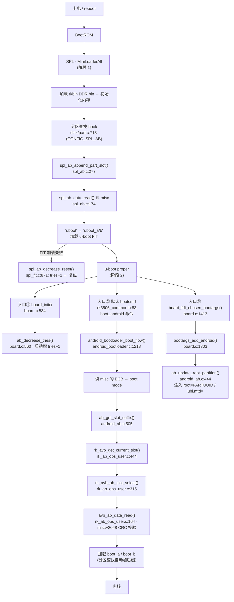

# u-boot 启动链与构建(RK3506 / RK3506B)

本文记录本仓库 u-boot 的**项目路径、配置体系、构建方式**,以及 **u-boot 启动链**
(BootROM → SPL → u-boot proper → 内核)中 A/B 双槽(AvbABData)由谁、在哪个入口、
如何被选择。所有行号以 vendored 树为准;适用板 `lyra-ultra-w-emmc-ab`(eMMC,SPL-A/B)
与 `lyra-zero-w-spinand-ab-amp`(SPI NAND,单 uboot 槽)。配套背景见
[doc/ab-boot.md](ab-boot.md) 与 [doc/ab-boot-nand.md](ab-boot-nand.md)。

---

## 1. u-boot 项目路径

### 1.1 本仓库内与 u-boot 相关的路径

| 路径 | 干什么 |
|---|---|
| `vendor/rockchip/u-boot/` | **vendored Rockchip u-boot 源码**(git submodule,固定镜像)。一切 u-boot 构建/启动代码都在这里 |
| `vendor/rockchip/rkbin/` | **预编译二进制**:DDR 初始化 bin、SPL bin、OP-TEE(tee)bin、loader 打包 ini |
| `product/platform/configs/uboot/` | **产品侧集中维护的 u-boot 配置**:base defconfig + 可选 fragment(完整构建时覆盖 vendored 树) |
| `product/platform/dts/` | **内核侧板级设备树**(`KERNEL_DTS`,不进 u-boot;u-boot 用自己的 dts,见 §1.2) |
| `config/boards/<target>.mk` | 板级定义:`UBOOT_CFG` / `UBOOT_FRAGMENTS` / `UBOOT_SPL` 等(见 §3.4) |
| `stages/10-uboot/run.sh` | **uboot 构建 stage 配方**:调 `make.sh` 并收集产物 |
| `scripts/build.py` + `context.py` / `engine.py` / `config.py` | 构建编排:解析 .mk → 注入环境 → 按序执行各 stage |
| `Makefile` | 顶层入口(`make build / make uboot / make uboot-menuconfig …`) |

### 1.2 vendored u-boot 源码树(`vendor/rockchip/u-boot/`)

| 目录 | 干什么 |
|---|---|
| `arch/arm/mach-rockchip/` | **SoC 板级代码**:`board.c`(board_init / board_late_init / bootargs 注入)、`rk3506/`(rk3506.c、syscon 等)、`make_fit_optee.sh`(SPL 加载的 FIT 生成器) |
| `arch/arm/dts/` | **u-boot 自己的设备树**:`rk3506-luckfox.dts`(`CONFIG_DEFAULT_DEVICE_TREE`)+ `rk3506-u-boot.dtsi`(SPL/proper 专用节点标记) |
| `board/` | 板级代码(rockchip/…) |
| `common/` | 通用功能:`android_ab.c`(A/B 核心)、`android_bootloader.c`(boot_android 主流程)、`spl/`(spl_ab.c、spl_fit.c)、`part.c` 相关 |
| `configs/` | 各板 defconfig;`rk3506_luckfox_defconfig` 是产品侧 defconfig 的落地处 |
| `disk/` | 分区表:`part.c`(含 `CONFIG_ANDROID_AB` / `CONFIG_SPL_AB` 的槽位后缀 hook) |
| `cmd/` | u-boot 命令(`boot_android`、`ab_select` 等) |
| `drivers/` | 外设驱动:`ram/rockchip/`(DDR 驱动,见 §2.2)、`mtd/`(`mtd_blk.c` 的 `mtd_dwrite`)、serial、spi-flash 等 |
| `include/configs/` | **板级配置头**:`rk3506_common.h`(SPL/proper 宏)、`evb_rk3506.h` |
| `lib/avb/` | **Rockchip AVB 用户态库**:`rk_avb_user/rk_ab_ops_user.c`(槽位选择实现)、`libavb_ab/avb_ab_flow.c` |
| `include/android_avb/` | AVB 头文件:`avb_ab_flow.h`(AvbABData 权威定义) |
| `scripts/` | Rockchip 构建脚本:`make.sh`(主入口)、`fit.sh` + `fit-core.sh`(FIT 打包)、`spl.sh`(MiniLoader 打包)、`loader.sh` |
| `spl/` / `tpl/` | SPL / TPL 源码 |
| `tools/` | 主机工具:`mkimage`(打包 FIT/loader)、rk 工具 |
| `env/` | 环境变量默认值 |
| `make.sh` | **Rockchip 构建/打包主脚本**(见 §3.2) |

### 1.3 rkbin(`vendor/rockchip/rkbin/`)

| 路径 | 干什么 |
|---|---|
| `bin/rk35/rk3506_ddr_750MHz_v1.04.bin` | RK3506 的 **DDR 初始化二进制**(750 MHz) |
| `bin/rk35/rk3506b_ddr_750MHz_v1.04.bin` | RK3506B 变体 |
| `bin/rk35/rk3506_spl_v1.10.bin` | 官方预编译 SPL(仅作 MINIALL.ini 默认;实际构建用 `--spl-new` 以刚编译的 SPL 覆盖) |
| `bin/rk35/rk3506_tee_v1.25.bin` | **OP-TEE** 预编译二进制(打进 `trust.img`) |
| `bin/rk35/rk3506_usbplug_v1.02.bin` | USB 下载/loader 模式固件 |
| `RKBOOT/RK3506(M)INIALL.ini` | **MiniLoader 打包描述**(DDR bin + SPL bin 组合) |
| `RKTRUST/RK3506TOS.ini` | **trust.img 打包描述**(tee bin + 加载地址) |

---

## 2. 配置体系

### 2.1 Kconfig 配置 —— 决定"编译什么"

- **base defconfig**:`product/platform/configs/uboot/rk3506_luckfox_defconfig`
  —— 与 vendored `vendor/rockchip/u-boot/configs/rk3506_luckfox_defconfig` **逐字节相同**(产品侧维护,完整构建覆盖 vendored)。所有 `CONFIG_SPL_*`、`CONFIG_ROCKCHIP_*`、`CONFIG_DEFAULT_DEVICE_TREE="rk3506-luckfox"` 都在这。
- **fragment**(可选叠加):`rk3506b_luckfox.config`(默认)、`rk3506b_luckfox_ab.config`(A/B:加 `CONFIG_ANDROID_AB` + AVB 库)、`rk3506b_luckfox_ab_amp.config`(A/B + AMP)。fragment 只管 u-boot **proper** 的开关,**不含 `CONFIG_SPL_*`**(注释明确 `CONFIG_SPL_AB=y … already come`)。
- **合并规则**:`make.sh` 对每个 `.config` 参数都是 `make <base> <frag>.config` **整包重生成**,多个 fragment **最后一个赢**;base 必须是 `configs/` 里存在的名字(`rk3506_luckfox` → `rk3506_luckfox_defconfig`)。
- **产物**:合并后的最终配置在 `vendor/rockchip/u-boot/.config`;`CONFIG_SPL_BUILD` 区分 SPL 编译路径。

### 2.2 SPL 运行期配置 —— 启动时"实际用到"的配置

Kconfig 只决定"用不用",SPL 启动时真正读取的配置来自四个来源:

**(1) 板级配置头(编译期宏,定 SPL 内存布局)**

`vendor/rockchip/u-boot/include/configs/rk3506_common.h`(SPL 与 proper 共用):

| 宏 | 值 | 含义 |
|---|---|---|
| `CONFIG_SPL_TEXT_BASE` | `0x03f00000` | SPL 运行基址(加载进 DDR 的位置) |
| `CONFIG_SPL_MAX_SIZE` | `0x40000` | SPL 镜像上限 256 KB |
| `CONFIG_SPL_BSS_START_ADDR` / `_MAX_SIZE` | `0x03fe0000` / `0x20000` | SPL 的 BSS 段 |
| `CONFIG_SPL_STACK` | `0x03f00000` | SPL 栈顶 |
| `CONFIG_SYS_INIT_SP_ADDR` | `0x00600000` | SPL 早期栈(BootROM 阶段) |
| `CONFIG_SYS_SDRAM_BASE` / `SDRAM_MAX_SIZE` | `0` / `0xc0000000` | 内存基址 / 最大容量(3 GiB) |

`include/configs/evb_rk3506.h` 只管 proper 的 env / bootcmd,SPL 阶段被
`#ifndef CONFIG_SPL_BUILD` 排除。

**(2) DDR 初始化 —— 关键:rkbin 二进制,不是软件驱动**

`drivers/ram/rockchip/sdram_rk3506.c` **只有 21 行、基本是空的**——rk3506 的 DDR
初始化不在 u-boot 源码里,而是 rkbin 的 **DDR 二进制**在 SPL 最早阶段加载执行:
`bin/rk35/rk3506_ddr_750MHz_v1.04.bin`(RK3506B 用 `rk3506b_` 变体)。DDR 时序参数
固化在该 bin 内,**只有 750 MHz 一种方案**,没有 dts 配置、没有参数文件。

**(3) SPL 的设备树**

`CONFIG_SPL_OF_CONTROL=y` + `CONFIG_SPL_DTB_MINIMUM=y`(`rk3506_luckfox_defconfig:74-77`):
SPL 用**裁剪过的 u-boot dtb**。来源是 u-boot 树内 `arch/arm/dts/rk3506-luckfox.dts`
(+ `rk3506-u-boot.dtsi` 的 `u-boot,dm-spl` / `u-boot,dm-pre-reloc` 节点标记);
`CONFIG_OF_SPL_REMOVE_PROPS="interrupt-parent assigned-clocks …"` 去掉 SPL 用不到的
中断/时钟属性。SPL 从这里读存储控制器、UART、时钟等节点。

**(4) u-boot 的加载位置 —— 分区表,不是固定偏移**

rk3506 **没有** `CONFIG_SYS_SPI_U_BOOT_OFFS` 这类固定偏移宏。Rockchip SPL 通过
**分区表**(EFI GPT,配合 `CONFIG_SPL_LIBDISK_SUPPORT`)找 `uboot` 分区(SPL-A/B 时
`uboot_a/b`,即 §4.2 的 `disk/part.c:713` 槽位查找)加载 u-boot FIT。FIT 布局由
`CONFIG_SPL_FIT_GENERATOR="arch/arm/mach-rockchip/make_fit_optee.sh"` 决定。

### 2.3 设备树 —— u-boot 与内核各用各的

- **u-boot**:`arch/arm/dts/rk3506-luckfox.dts`(`CONFIG_DEFAULT_DEVICE_TREE`),
  include `rk3506.dtsi` + `rk3506-luckfox.dtsi` + `rk3506-u-boot.dtsi`。A/B 的
  `root=`/`ubi.mtd=` 注入发生在 bootargs 阶段(§4.3 入口③),**不在 dts 里**。
- **内核**:`product/platform/dts/rk3506b-luckfox-*.dts`(板级 `KERNEL_DTS`)——只供
  kernel stage 使用,u-boot 构建不碰。

---

## 3. u-boot 构建方式

### 3.1 调用链

```
make build BOARD=<target>
  → tools/docker/run.sh(进固定容器)
  → scripts/build.py build --board <target>
      → engine.py run_stages → 依序执行 stages/{10-uboot,20-kernel,30-rootfs,40-firmware}/run.sh
  → stages/10-uboot/run.sh
      → cd vendor/rockchip/u-boot
      → ./make.sh <UBOOT_CFG> <UBOOT_FRAGMENTS...> --spl-new
      → 收集 *_loader_*.bin → MiniLoaderAll.bin、uboot.img、trust.img → out/firmware/
```

部分构建(`make uboot BOARD=x`):`FULL=0`,若 `.config` 已存在则**跳过配置重生成**,
保留手工调整(如 `make uboot-menuconfig` 的结果)。

### 3.2 `make.sh` 完整流程

`make.sh rk3506_luckfox rk3506b_luckfox_ab --spl-new` 的主流程
(`process_args → prepare → select_toolchain → select_chip_info → select_ini_file
→ sub_commands → make all → pack_images → finish`):

1. **process_args** —— 重生成 `.config`:
   - `rk3506_luckfox`(base)→ `make rk3506_luckfox_defconfig`;
   - `rk3506b_luckfox_ab`(fragment)→ `make <base> rk3506b_luckfox_ab.config`
     (**整包重生成,最后者赢**);
   - `--spl-new` 不被 make.sh 自身识别,落到默认分支透传给
     `scripts/fit.sh --args --spl-new`(这是 **fit.sh 的参数**,见下)。
2. **select_chip_info** —— 从 `.config` 读 `CONFIG_ROCKCHIP_RK3506` → `RKCHIP=RK3506`。
3. **select_ini_file** —— 选打包描述:
   - `INI_LOADER = rkbin/RKBOOT/RK3506MINIALL.ini`(RK3506B 用 `RK3506BMINIALL.ini`);
   - `INI_TRUST = rkbin/RKTRUST/RK3506TOS.ini`(rk3506 无 TRUST.ini,走 TOS.ini)。
4. **make all** —— 编译 u-boot proper + SPL(`spl/u-boot-spl.bin`)。
5. **pack_images** —— `CONFIG_ROCKCHIP_FIT_IMAGE_PACK=y` → `PLAT_TYPE="FIT"`
   → **`pack_fit_image`**(make.sh:730,先清掉旧的 `uboot.img` / `trust*.img`)→
   `scripts/fit.sh`;`handle_args_late` 把 `--ini-trust ${INI_TRUST}` /
   `--ini-loader ${INI_LOADER}` 一并传进去:
   - `fit_raw_compile`:把 SPL 重新拼成 `spl/u-boot-spl.bin`(spl-nodtb + spl.dtb);
   - 因 `--spl-new`:`./make.sh --spl ${INI_LOADER}` → `pack_spl_loader_image`
     → **`scripts/spl.sh` 按 MINIALL.ini 打包 MiniLoader**(见 §3.3);
   - `fit_gen_uboot_itb` / `fit_gen_uboot_img`:用 `make_fit_optee.sh`
     (`CONFIG_SPL_FIT_GENERATOR`)生成 `u-boot.its` → `tools/mkimage -f` 打包
     `u-boot.itb` → **uboot.img**;
   - trust 侧:fit.sh 按 `--ini-trust` 指向的 RK3506TOS.ini,把 make.sh:565 从
     rkbin 拷出的 `tee.bin` 打成 **trust.img**。(非 FIT 平台才走
     `pack_trust_image`,make.sh:713。)

### 3.3 打包产物

| 产物 | 内容 | 生成处 |
|---|---|---|
| `MiniLoaderAll.bin` | **DDR bin + SPL bin + USB plug bin** 复合体,BootROM 最先加载 | `scripts/spl.sh`(按 `RKBOOT/*MINIALL.ini`;`FlashData`=ddr bin,`FlashBoot`=spl bin,`CODE472`=usbplug → 保证 USB 下载模式,`LOAD_ADDR=0x3f00000`=`CONFIG_SPL_TEXT_BASE`) |
| `uboot.img` | **u-boot FIT**(u-boot + optee),被 SPL 加载 | `scripts/fit.sh`(`fit_gen_uboot_img`) |
| `trust.img` | OP-TEE(`rk3506_tee_v1.25.bin`,ADDR=0x1000) | `scripts/fit.sh`(按 `--ini-trust RK3506TOS.ini`) |

`stages/10-uboot/run.sh` 最后把 `./*_loader_*.bin` 重命名为 `MiniLoaderAll.bin`,
`uboot.img`、`trust.img` 复制进 `out/firmware/`。`flash.sh` / `upgrade_tool` 烧写时,
`MiniLoaderAll.bin` 就是 BootROM 最先加载的镜像。

### 3.4 板级接线(`config/boards/*.mk` → 环境变量)

`scripts/config.py` 把 `.mk` 里的 `KEY := VALUE` 全部解析成环境变量
(`BoardConfig.to_env()`),`engine.run_stage` 注入 stage 的 `run.sh`。uboot 相关的键:

| .mk 键 | 例(`lyra-ultra-w-emmc-ab.mk`) | 用途 |
|---|---|---|
| `UBOOT_CFG` | `rk3506_luckfox` | base defconfig 名 |
| `UBOOT_FRAGMENTS` | `rk3506b_luckfox_ab` | fragment 名(可多个,空格分隔) |
| `UBOOT_ARCH` | `arm` | 工具链架构 |
| `UBOOT_SPL` | `y` | 是否产出/检查 SPL |

`stages/10-uboot/run.sh` 里 `MAKE_ARGS=(CROSS_COMPILE="$TOOLCHAIN_PREFIX" $UBOOT_CFG
$UBOOT_FRAGMENTS --spl-new)` 直接消费这些变量。`TOOLCHAIN_PREFIX` 来自
`context.toolchain_env()`(`gcc-arm-10.3-2021.07-x86_64-arm-none-linux-gnueabihf`)。

---

## 4. 启动链

### 4.1 总览



### 4.2 阶段 1:SPL(MiniLoaderAll)

启动最早阶段,`MiniLoaderAll.bin` 由 BootROM 从存储读入:先执行 **rkbin 的 DDR bin**
(初始化内存),再执行编译出的 SPL 代码。SPL 运行期配置来源见 §2.2(内存布局宏 /
DDR bin / SPL dtb / 分区表加载)。

| 锚点 | 作用 |
|---|---|
| `disk/part.c:713` | `CONFIG_SPL_AB && CONFIG_SPL_BUILD` 时,分区查找给名字加槽位后缀 |
| `common/spl/spl_ab.c:277` `spl_ab_append_part_slot()` | 读 misc 的 `AvbABData`,把 `uboot` → `uboot_a/b` |
| `common/spl/spl_ab.c:174` `spl_ab_data_read()` | SPL 侧读取并校验 `AvbABData`(SPL 里无完整 libavb) |
| `common/spl/spl_fit.c:871` | u-boot FIT 加载失败 → `spl_ab_decrease_reset()`:tries−1 后复位 |

要点:

- **eMMC A/B 板**:SPL 参与 A/B。每次分区查找(`disk/part.c:713`)遇到名字不是以
  `_a`/`_b` 结尾时,就调 `spl_ab_append_part_slot()` 拿槽位后缀。FIT 加载失败会
  递减 tries 并复位,实现"SPL 层的 uboot 槽位回滚"。
- **NAND 板**:单一 `uboot` 槽。`spl_ab_append_part_slot()` 找不到 `uboot_a`/`uboot_b`,
  退化到无后缀的名字,SPL 对 A/B 完全透明——槽位决策全部在 u-boot proper。

### 4.3 阶段 2:u-boot proper

#### 入口① `board_init()` —— 回滚计数

`arch/arm/mach-rockchip/board.c:534` 的 `board_init()` 里,`CONFIG_ANDROID_AB` 时调用
`ab_decrease_tries()`(`board.c:560` → `common/android_ab.c:528`):把当前启动槽的
`tries_remaining` 减一并写回 misc。这是"内核级回滚"的触发点——槽位在用户态标记
成功之前每启动一次就递减一次。

#### 入口② 默认 bootcmd —— 槽位选择与 boot 加载

`include/configs/rk3506_common.h:83` 定义默认启动命令:

```c
#define RKIMG_BOOTCOMMAND		\
	"boot_fit;"			\
	"boot_android ${devtype} ${devnum};"
```

`boot_android` 命令(`cmd/boot_android.c:71`)进入 `android_bootloader_boot_flow()`
(`common/android_bootloader.c:1218`),流程:

1. **读 BCB 判 boot mode**:`android_bootloader_load_and_clear_mode()` 读 misc 里的
   `BootloaderMessage`,得到 normal / recovery / bootloader。
2. **取槽位后缀**:`ab_get_slot_suffix()`(`common/android_ab.c:505`)→
   `rk_avb_get_current_slot()`(`rk_ab_ops_user.c:444`)→
   `rk_avb_ab_slot_select()`(`rk_ab_ops_user.c:315`)→
   `avb_ab_data_read()`(`rk_ab_ops_user.c:164`,读 misc+2048、CRC 校验)→ `_a`/`_b`。
   槽位决策(`rk_avb_ab_slot_select()`)在 AVB 用户态库内实现:比较两槽的可启动性
   (bootable 判断 + priority 比较)。
3. **加载 boot 镜像**:normal 分支走 `android_image_load_by_partname(dev_desc, "boot", …)`,
   其内部 `part_get_info_by_name("boot")` 命中 `disk/part.c:703` 的
   `CONFIG_ANDROID_AB` 分支 → `rk_avb_append_part_slot()` → 再次走
   `rk_avb_get_current_slot()` → 分区名变成 `boot_a/b`,加载 Android boot.img → `bootm`。

#### 入口③ `board_fdt_chosen_bootargs()` —— root= 注入

`arch/arm/mach-rockchip/board.c:1413` 的 `board_fdt_chosen_bootargs()` 在构造内核
chosen 节点时,经 `bootargs_add_android()`(`board.c:1303`)调用
`ab_update_root_partition()`(`board.c:1306` / `common/android_ab.c:444`):

- 先 `env_update_filter("bootargs", …, "root=")` **删除旧的 `root=`**(以及注入前
  的 `ubi.mtd=`),避免残留参数误导内核;
- 按存储类型注入根设备参数:
  - eMMC / GPT:`root=PARTUUID=<system_a|system_b 的 UUID>`(`ab_update_root_uuid()`);
  - SPI NAND / MTD:`rootfstype=ubifs` 时 `ubi.mtd=<part_num-1> root=ubi0:system`
    (`android_ab.c:105-108`,卷名硬编码 `system`,不是槽后缀);
- 同时追加 `androidboot.slot_suffix=_a`(由内核 cmdline 的 slot 解析)。

### 4.4 槽位选择的接入点

A/B 槽位选择在启动链上有两个接入点,最终都汇到 `rk_avb_ab_slot_select()`
(proper)或 `spl_ab_append_part_slot()`(SPL):

| 决策点 | 代码路径 | 作用 |
|---|---|---|
| **显式**:boot flow 拿 slot_suffix | `ab_get_slot_suffix()` → `rk_avb_get_current_slot()` → `rk_avb_ab_slot_select()` | 决定当前槽 `_a/_b`,用于 boot image 加载 + bootargs |
| **隐式**:分区名自动加后缀 | `disk/part.c:703` → `rk_avb_append_part_slot()`(proper)/ `spl_ab_append_part_slot()`(SPL) | 每次 `part_get_info_by_name("boot"/"system"/"uboot")` 自动变 `boot_a/b` |

### 4.5 last_boot 回退的生效路径

`ab_get_slot_suffix()` 无可用槽位时的 last_boot 回退,只在 `#ifndef CONFIG_ANDROID_AVB`
下编译(`common/android_ab.c:509`);而本板 `CONFIG_ANDROID_AVB` 是开着的,所以
`rk_avb_get_current_slot()` 内部(`rk_ab_ops_user.c:455`)那段 `rk_get_lastboot()` 回退
才是实际生效的路径——两处代码结构一样,但生效的是后者。

### 4.6 入口/锚点速查表

| 层 | 函数 | 文件:行 | 说明 |
|---|---|---|---|
| SPL | `spl_ab_append_part_slot` | `common/spl/spl_ab.c:277` | 给分区名加槽位后缀 |
| SPL | `spl_ab_data_read` | `common/spl/spl_ab.c:174` | 读/校验 AvbABData |
| SPL | `spl_ab_decrease_reset` | `common/spl/spl_fit.c:871` | FIT 失败 → tries−1 复位 |
| proper | `board_init` | `arch/arm/mach-rockchip/board.c:534` | 启动早期钩子 |
| proper | `ab_decrease_tries` | `board.c:560` / `common/android_ab.c:528` | 启动槽 tries−1 |
| proper | `RKIMG_BOOTCOMMAND` | `include/configs/rk3506_common.h:83` | 默认 bootcmd |
| proper | `android_bootloader_boot_flow` | `common/android_bootloader.c:1218` | Android 启动主流程 |
| proper | `ab_get_slot_suffix` | `common/android_ab.c:505` | 取 `_a/_b` |
| proper | `rk_avb_get_current_slot` | `lib/avb/rk_avb_user/rk_ab_ops_user.c:444` | 槽位选择入口 |
| proper | `rk_avb_ab_slot_select` | `rk_ab_ops_user.c:315` | 槽位决策 |
| proper | `avb_ab_data_read` | `rk_ab_ops_user.c:164` | 读 misc+2048 + CRC |
| proper | `board_fdt_chosen_bootargs` | `arch/arm/mach-rockchip/board.c:1413` | bootargs 注入入口 |
| proper | `ab_update_root_partition` | `board.c:1306` / `common/android_ab.c:444` | 注入 root=PARTUUID / ubi.mtd= |

---

## 5. 阅读顺序建议

1. **项目路径**(本文件 §1)—— 知道东西在哪。
2. **配置体系**(§2)—— base defconfig + fragment + SPL 运行期四来源。
3. **构建方式**(§3)—— `make.sh` 如何从 defconfig 编出 `MiniLoaderAll.bin` +
   `uboot.img` + `trust.img`。
4. **启动链**(§4)—— 按入口② `boot_android` → `rk_avb_ab_slot_select` →
   `ab_update_root_partition` 的顺序精读。
5. **数据契约**:`include/android_avb/avb_ab_flow.h` 的 `AvbABData` 结构 +
   `tools/scripts/mkabmeta.py` 的 `parse()`/`build()`。
6. **用户态工具**:`abctl`(eMMC GPT 后端 / NAND MTD 后端)+ `ota-update`,看它们如何
   与 misc 交互(mark-success / set-active)。
7. **固件组装**:`stages/40-firmware/run.sh` 的 `AB=1` 分支 + `mkabmeta.py` + parameter。
